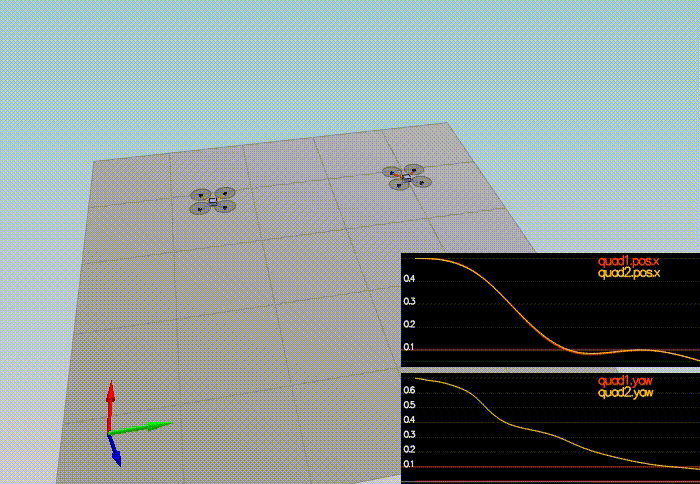

# FCND-Controls-P3
CPP Controller for a simple quadcopter

This is the README for the Controls project of Udacity Flying Car ND [Link](https://github.com/udacity/FCND-Controls-CPP).

We need to build a CPP controller and tune the parameters based on the different requirements in each scenarios - 1 to 5.

**Files in submission**
* QuadControl.cpp - The main CPP controller code.
* QuadControlParams.txt - Configuration for the controller containing the tuned parameters.

**Requirements of the project**
1. Development environment setup - Xcode for Mac OS X.
2. Compile and test the simulator on the IDE.
3. Adjust the `mass` to make the quad hover at the same altitude.
4. Implement the body Rate control using the `GenerateMotorCommands` and `BodyRateControl` methods.Tune `kpPQR` to get the vehicle to stop spinning.
5. Implement roll / pitch control using the `RollPitchControl` method.Tune `kpBank` to minimize settling time.
6. Implement code in `LateralPositionControl` and `AltitudeControl` . Tune parameters `kpPosXY` and `kpPosZ` , `kpVelXY` and `kpVelZ`. 
7. Implement code in `YawControl` . Tune `kpYaw`since one quad is rotated in yaw.
8. Explore some of the non-idealities and robustness of a controller by tweaking all parameters and adding in a integral control and tuning it.

**Cascaded Controller**

We will be implementing this basic cascaded controller for this project as shown in the image.
<p align="center">

</p>

### Scenarios ###

###### Scenario 1 - Intro ######

This is the Intro scene. The `mass` is so adjusted that the quad is able to hover at a constant altitude as long as possible.
<p align="center">


</p>

###### Scenario 2 - Body rate and roll/pitch control ######

Quad is created with a small initial rotation speed about its roll axis. The controller needs to stabilize the rotational motion and bring the vehicle back to level attitude.
<p align="center">


</p>

###### Scenario 3 - Position/velocity and yaw angle control ######

There are 2 identical quads, one offset from its target point (but initialized with yaw = 0) and second offset from target point but yaw = 45 degrees. On successful implementation and tuning, the quads should be going to their destination points.
<p align="center">


</p>

###### Scenario 4 - Non-idealities and robustness ######

This scenario explores some of the non-idealities and robustness of a controller. There are three quads.
 - The green quad has its center of mass shifted back
 - The orange vehicle is an ideal quad
 - The red vehicle is heavier than usual
 
<p align="center">


</p>

###### Scenario 5 - Tracking trajectories ######

Aim of this scenario is to test the quad's performance once again on a trajectory. This scenario has two quadcopters:
 - the orange one is following `traj/FigureEight.txt`
 - the other one is following `traj/FigureEightFF.txt`
<p align="center">


</p>

### Implemented Controller ###

1. Implemented Body rate control

```V3F momentI;

  momentI.x = Ixx;
  momentI.y = Iyy;
  momentI.z = Izz;
    
  V3F err_rate = (pqrCmd - pqr);

  momentCmd = momentI * kpPQR * err_rate ; ```
